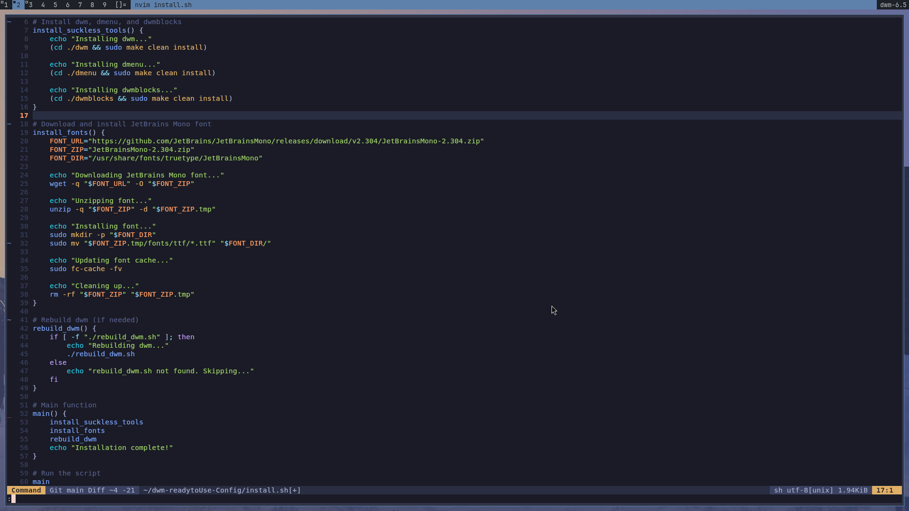

# 🌟 dwm-readytoUse-Config

A **pre-configured and ready-to-use setup** for **dwm** (Dynamic Window Manager), designed for minimalists, power users, and anyone seeking a fast, efficient, and customizable desktop environment. This repository provides a streamlined installation process, complete with essential patches, custom keybindings, and a sleek design, making it perfect for those who want a hassle-free dwm experience.

---

## ✨ Features

- 🛠️ **Pre-Patched dwm**: Includes popular patches for enhanced functionality.
- ⚡ **Custom Keybindings**: Optimized for productivity with intuitive window management and application launching.
- 🚀 **dmenu Integration**: A fast and lightweight application launcher, pre-configured for quick access.
- 📊 **dwmblocks Status Bar**: A modular status bar with system monitoring (CPU, memory, battery, etc.).
- 🔤 **JetBrains Mono Font**: A modern, open-source font for better readability in terminals and editors.
- 🖥️ **Easy Installation**: A single script to install and configure everything automatically.
- 🧘 **Minimalist Design**: Clean and distraction-free, with a focus on usability and aesthetics.

---

## 💡 Why Use This?

- ⏱️ **Save Time**: Skip the tedious process of manually configuring dwm and applying patches.
- 🪶 **Lightweight**: Built for performance, dwm is incredibly fast and efficient, even on older hardware.
- 🛠️ **Customizable**: While pre-configured, the setup is fully customizable to suit your workflow.
- 🌐 **Community-Driven**: Includes patches and configurations inspired by the dwm community.

---

## 🚀 Quick Start

1. Clone the repository:

    ```bash
    git clone https://github.com/Vasant-rawat/dwm-readytoUse-Config.git
    cd dwm-readytoUse-Config
    ```

2. Run the installation script:

    ```bash
    ./install.sh
    ```

3. Log out and select **dwm** from your display manager, or add `exec dwm` to your `.xinitrc` if using `startx`.

---


## ⌨️ Keybindings

Below is the list of default keybindings for dwm in this configuration:

### General
- **`Alt + p`**: Launch `dmenu` (application launcher).
- **`Alt + Shift + Enter`**: Open the terminal (`kitty`).
- **`Alt + b`**: Toggle the visibility of the status bar.

### Window Management
- **`Alt + j`**: Focus on the next window.
- **`Alt + k`**: Focus on the previous window.
- **`Alt + h`**: Shrink the master area width.
- **`Alt + l`**: Increase the master area width.
- **`Alt + i`**: Increase the number of master windows.
- **`Alt + d`**: Decrease the number of master windows.
- **`Alt + Enter`**: Move the focused window to the master area.
- **`Alt + Space`**: Switch between layouts (tiled, floating, monocle).
- **`Alt + Shift + Space`**: Toggle floating mode for the focused window.
- **`Alt + Tab`**: Cycle through visible windows.

### Layouts
- **`Alt + t`**: Set the layout to tiled (default).
- **`Alt + f`**: Set the layout to floating.
- **`Alt + m`**: Set the layout to monocle (maximize all windows).

### Monitor and Workspace
- **`Alt + comma`**: Focus on the previous monitor.
- **`Alt + period`**: Focus on the next monitor.
- **`Alt + Shift + comma`**: Move the focused window to the previous monitor.
- **`Alt + Shift + period`**: Move the focused window to the next monitor.
- **`Alt + [1-9]`**: Switch to a specific tag (workspace).
- **`Alt + Shift + [1-9]`**: Move the focused window to a specific tag.

### Miscellaneous
- **`Alt + Shift + c`**: Close the focused window.
- **`Alt + Shift + q`**: Quit dwm.

---

## 🛠️ Included Tools

- 🖥️ **dwm**: The core window manager with essential patches.
- ⚡ **dmenu**: A fast and lightweight application launcher.
- 📊 **dwmblocks**: A modular status bar for system monitoring.
- 🔤 **JetBrains Mono Font**: A modern monospaced font for coding and terminals.

---

## 🖼️ Screenshots

*A clean and minimal dwm setup with custom keybindings and status bar.*

---

## 🤝 Contributing

Feel free to fork this repository and customize it to your needs. If you have suggestions or improvements, open an issue or submit a pull request! 💡

---

🎉 **Enjoy your minimal and blazing-fast dwm setup!**

